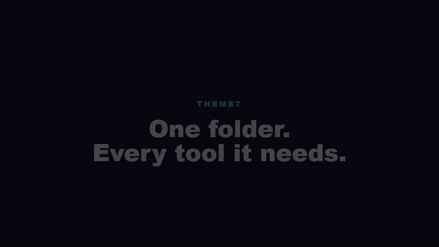

# Video Factory

A standalone Remotion factory for Gorge comedy films, source-faithful theme7 interaction showpieces, and the revived Windows SAPI voice-and-mouth engine.

[](media/gorge-finds-omp-theme7.mp4)

**[Open the full-resolution Gorge MP4 with audio](media/gorge-finds-omp-theme7.mp4)**

The film shows Gorge discovering OMP, switching between theme7 jobs, moving through terminal/Files/Git views, and dragging a Browser pane into the workspace to reveal his terrible GorgeCities fan page.

## Standalone theme7 showpiece

[](media/theme7-showpiece.mp4)

**[Open the full-resolution theme7 MP4](media/theme7-showpiece.mp4)**

## What is included

- The complete source-driven Gorge story renderer and its additive prior scripts.
- The theme7 job-switch, folder/tool workflow, and Browser-drop interaction scenes.
- The finished Gorge and theme7 MP4s under `media/`.
- Source images, props, OMP identification assets, generated narration, mouth frames, and render props.
- The revived retro Windows SAPI engine under `tts/`, including its native source, lip-sync logic, tests, and local preview API.
- Contract, caption, motion, and OMP-brand tests.

This repository is deliberately only the Video Factory. It contains no application runtime, deployment machinery, database, credentials, or unrelated product-film inventory.

## Run the included render immediately

Requires Node.js 24 and npm 10 or 11.

```sh
npm ci
npm run typecheck
npm test
npm run render:prepared
```

The prepared render uses the checked-in narration and mouth frames and writes `out/gorge-finds-omp-theme7.mp4`.

## Regenerate narration and mouth animation

The retro voice service is Windows-only and expects the included native binaries or a local MinGW toolchain capable of rebuilding them.

```sh
npm ci
npm --prefix tts ci
npm --prefix tts run build:native
npm run voice
```

Leave that service running. In a second terminal:

```sh
npm run voices
npm run render
```

The story compiler sends each line to the local voice API, downloads the WAV and engine-timed mouth frames, rebuilds the lip-sync manifest, mixes the soundtrack, and invokes Remotion.

## Authoring

Edit or add a JSON story under `grug-stories/scripts/`. The story contract controls dimensions, frame rate, narration, five-word caption chunks, scene, camera, puppet motion, and voice settings.

```sh
npm run studio
npm run theme7:render
```

`source-clips/t4-code-drag-drop.mp4` remains available for the preserved older T4 Code scene. The final Gorge film uses the corrected Browser interaction instead.

## Assets and rights

Original source code authored for Video Factory is MIT licensed. Bundled Microsoft Speech API vendor material retains its original copyright notices and is excluded from that license; see [`THIRD_PARTY_NOTICES.txt`](THIRD_PARTY_NOTICES.txt). Third-party media and marks are not relicensed by the code license. See [`grug-stories/asset-sources.json`](grug-stories/asset-sources.json) for asset-level sources and terms. The OMP mark is used only to identify OMP. Published terminal and profile artwork contains no personal photograph, private session, local path, private commit, credential, or token-cost data.
